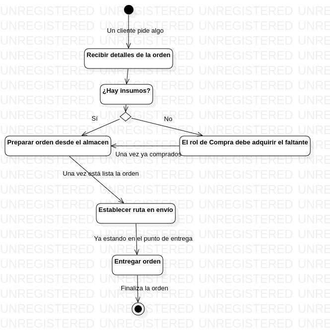

# Halcon sales & route project

- **Por**: Kevin Alejandro Leal Torres
- **A día:** jueves, 22 de febrero de 2024
- **Para:** La materia de "Diseño de páginas web"

## Contenido

1. Diagrama de clases

2. Diagrama de actividades

3. Diagrama ER

4. Diagrama BPMN:

## Metodología usada:

Dada la complejidad del proyecto “Halcon”, una metodología de trabajo adecuada sería scrum. ya que:

- **Desarrollo iterativo:** los requisitos del proyecto son detallados e involucran a múltiples stakeholders. Scrum permite el desarrollo iterativo, lo que significa que las funciones se pueden desarrollar incrementalmente y probarse en cada iteración, asegurando que el producto final satisfaga las necesidades del cliente.

- **Adaptabilidad:** Scrum permite incorporar cambios a lo largo del proceso de desarrollo. Dado que los requisitos pueden evolucionar o volverse más claros a medida que avanza el proyecto, esta flexibilidad es crucial para garantizar que el producto final se alinee con las expectativas del cliente.

- **Colaboración:** el proyecto involucra varios departamentos dentro de la organización, cada uno con su propio conjunto de requisitos y responsabilidades. Promueven la colaboración entre equipos, asegurando que todas las partes interesadas participen durante todo el proceso de desarrollo y se tengan en cuenta sus aportaciones.

- **Mejora continua:** Existen oportunidades periódicas para recibir comentarios y revisiones, lo que permite una mejora continua. Esto garantiza que cualquier problema o inquietud se pueda abordar con prontitud, lo que genera un producto final de mayor calidad.

## Reflexión personal:

Esta actividad es muy enriquecedora, pues me ayuda a entender qué son los diagramas UML, cómo hacerlos y para qué, esta actividad es muy buena para el mundo empresarial.
